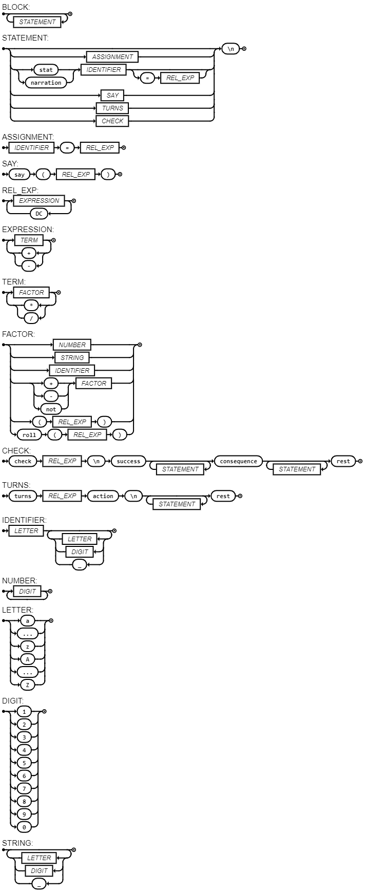

# DnD Langage

This is a custom coding language based on Dungeons & Dragons

## Usage
Clone the repository and execute test.py, it is set to run example.dndl by default

## EBNF
```
BLOCK = { STATEMENT };

STATEMENT = [ ASSIGNMENT |("stat"|"narration"), IDENTIFIER, ["=", REL_EXP] | SAY | TURNS | CHECK ], "\n" ;

ASSIGNMENT = IDENTIFIER, "=",  REL_EXP;
SAY = "say", "(", REL_EXP, ")" ;


REL_EXP = EXPRESSION, { "DC", EXPRESSION } ;
EXPRESSION = TERM, { ("+" | "-" ), TERM } ;
TERM = FACTOR, { ("*" | "/"), FACTOR } ;
FACTOR = NUMBER | STRING |IDENTIFIER | (("+" | "-" | "not"), FACTOR ) | "(", REL_EXP, ")" | "roll", "(",REL_EXP, ")" ;


CHECK = ("check", REL_EXP, "\n","success", { ( STATEMENT ) },  "consequence", { ( STATEMENT )}), "rest";
TURNS = "turns", REL_EXP,"action","\n",{ ( STATEMENT )}, "rest";


IDENTIFIER = LETTER, { LETTER | DIGIT | "_" } ;
NUMBER = DIGIT, { DIGIT } ;
LETTER = ( "a" | "..." | "z" | "A" | "..." | "Z" ) ;
DIGIT = ( "1" | "2" | "3" | "4" | "5" | "6" | "7" | "8" | "9" | "0" ) ;
STRING = ({LETTER | DIGIT | "_"});

```

## Diagram


This diagram was made by using: https://jacquev6.github.io/DrawGrammar/

## Apresentação
[DnD language presentation](apresentacao.pdf)